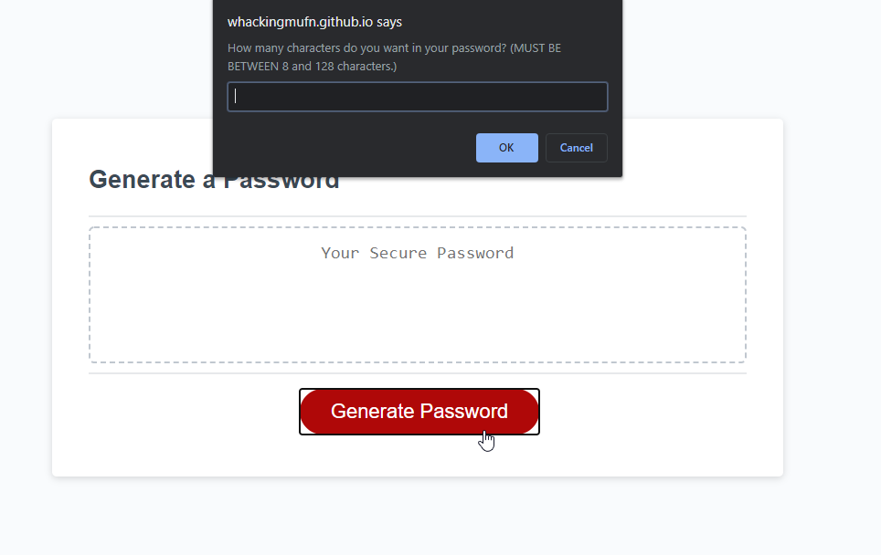
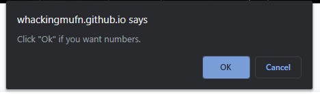
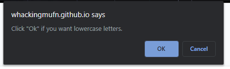
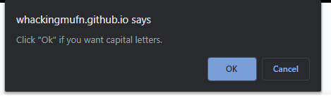
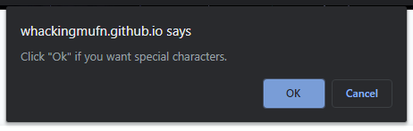
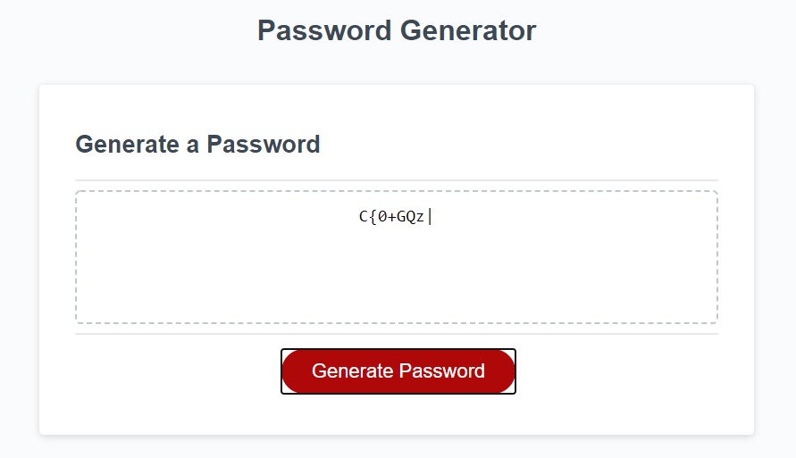

# Password Generator

## Description
The purpose of this assignment was to test my cumulative knowledge of JavaScript by creating a Password Generator that prompts the user for desired password length and password criteria: numbers, lowercase letters, uppercase letters, and special characters. The password length must be between 8 and 128 characters. User can select any combination of the criteria. If none of the criteria options are selector or the specified length is outside of the outlined range, a password will not generate.

## Live Site
[Live Password Generator](https://whackingmufn.github.io/Password-Generator/)

## Installation
The html, css, and script files are all in the same folder. If they're kept in the same folder after cloning, the application will run. If the end user changes the file structure, index.html must be updated with the new file paths for script.js and style.css in relation to index.html.

## Screenshots
#### Base Page
- 

#### Length Prompt
- 

#### Criteria Prompts
- 
- 
- 
- 

#### End Result
- 

## Credits
This assignment is provided by Trilogy Education Services. Trilogy Education Services provided the HTML and CSS for this assignment. Based on in class activities and lectures, [MDN](https://developer.mozilla.org/en-US/) Reference Documents for JavaScript syntax, and [JSHint](https://jshint.com/) for validation, I was able to create a successful password generator.

## License

[License](LICENSE.txt)
MIT &copy; 2020 Calvin Freese